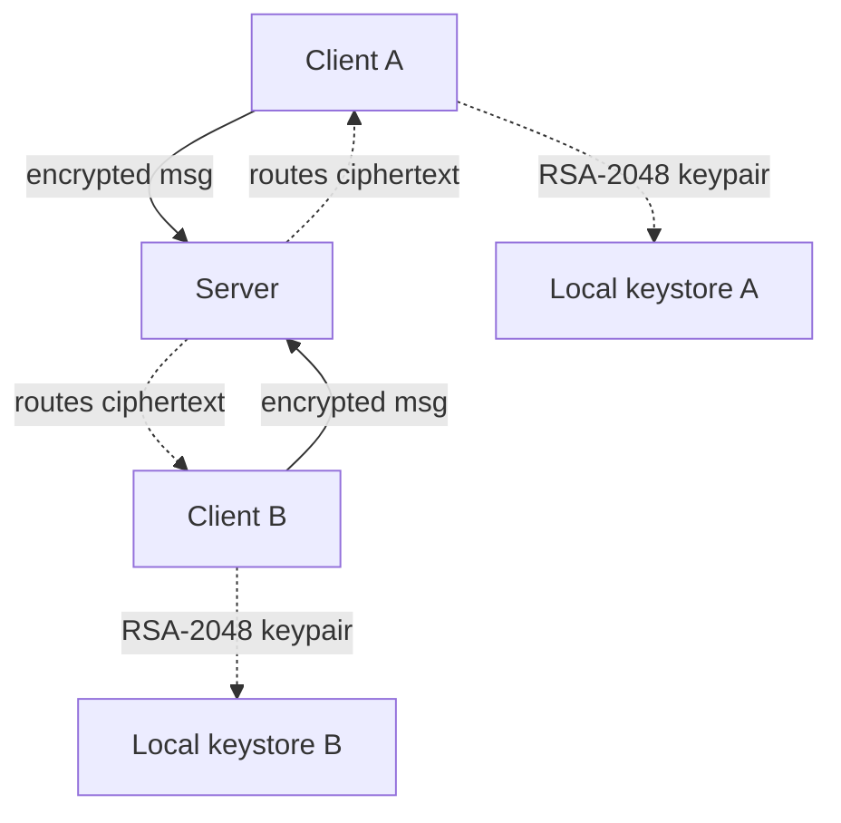

# Cypherush

> Speak in cipher, hear in hush, deliver in rush.


## About

Cypherush is an end-to-end encrypted messaging application. Messages are
encrypted on the sender's machine and decrypted only on the recipient's
machine — the relay server never has access to plaintext or private keys.
It pairs a hybrid RSA-2048 + AES-256-GCM cryptosystem with a modern Qt
desktop client and a lightweight TCP routing server.

The project was built as an Object-Oriented Programming semester project,
with the goal of putting cryptography into practice rather than treating
it as a black box. The name is a three-way blend: **Ciph**er (the
encryption at its core) + **hush** (the silence of true privacy) +
**rush** (fast, real-time delivery).

## Features

- 🔒 End-to-end encryption (hybrid RSA-2048 + AES-256-GCM)
- 🔑 PBKDF2 password hashing (100k iterations, salted)
- 💾 Encrypted persistent storage (AES-256-GCM on user data)
- 🎨 Modern UI with a custom splash animation
- 🌐 TCP client–server architecture (Qt Network)
- 🔐 Server address hidden from end users
- ⚡ Real-time message routing through a trusted-zero server

## Screenshots

| Splash | Login | Chat |
| ------ | ----- | ---- |
|  |  |  |

## Architecture



The server only sees ciphertext. Private keys never leave the client.
Even a fully compromised server cannot read messages.

## Tech Stack

- C++17
- Qt 6 (Widgets, Network)
- Crypto++ (RSA, AES, PBKDF2)
- CMake + Ninja build system
- Tested on: Windows 11 (MSYS2 UCRT64), Ubuntu 24.04

## Quick Start

### Prerequisites

- **Windows:** MSYS2 UCRT64 environment
- **Linux:** `build-essential`, `cmake`, `ninja`, `qt6-base-dev`,
  `libcrypto++-dev`

### Build (Windows / MSYS2 UCRT64)

```bash
git clone https://github.com/semihturker0/cypherush.git
cd cypherush
cmake -B build -G Ninja
cmake --build build
```

### Build (Linux)

```bash
sudo apt install -y build-essential cmake ninja-build qt6-base-dev libcrypto++-dev
git clone https://github.com/semihturker0/cypherush.git
cd cypherush
cmake -B build -G Ninja
cmake --build build
```

### Configure Server Address

The server address is stored in an obfuscated config file. After
building, set it once via:

```bash
./build/bin/cypherush_client --setup <SERVER_IP>
```

This writes to `%APPDATA%/Cypherush/config.dat` (Windows) or
`~/.local/share/Cypherush/config.dat` (Linux). Defaults to `127.0.0.1`
if no config exists.

### Run

```bash
# Server
./build/bin/cypherush_server

# Client (separate terminal)
./build/bin/cypherush_client
```

## Project Structure

```
cypherush/
├── common/              Shared between client and server
│   ├── crypto/          IEncryptor, AES, RSA, Hybrid, KeyManager, PasswordHasher
│   ├── data/            IRepository<T>, encrypted file storage
│   ├── exceptions/      Custom exception hierarchy (14 classes)
│   ├── models/          User, Message, Contact, KeyPair
│   └── network/         NetworkMessage, MessageProtocol
├── server/              ChatServer, server main
├── client/              ChatClient, services, UI
│   ├── services/        AuthenticationService, MessagingService, ServerConfig
│   └── ui/              SplashScreen, LoginWindow, MainChatWindow
└── docs/screenshots/    README assets
```

## Security Notes

### What is protected

- **Message content** — end-to-end encrypted; the server cannot read it
- **Stored user data** — AES-256-GCM at rest
- **Passwords** — PBKDF2-HMAC-SHA256, 100k iterations, 16-byte salt
- **Private keys** — PBKDF2-encrypted with the user's password

### Demo limitations (transparency for academic review)

- **Storage key:** currently hardcoded for the demo. Production should
  derive it via PBKDF2 from a master password.
- **Server IP obfuscation:** XOR-based; protects against casual
  inspection only, not cryptographically.
- **No certificate validation:** the TCP connection is not TLS-wrapped.
  Future work includes mutual TLS for transport-level confidentiality.

## Roadmap

Future work (post-submission patches):

- 💾 Persistent message history (per-user, locally encrypted)
- 👥 Persistent contact list
- 🔄 Auto-update system
- 📱 Multi-device key sync
- 🔐 Master-password-derived storage key
- 🌐 TLS-wrapped transport
- 📦 Inno Setup Windows installer (in progress)

## Academic Context

Cypherush was developed as a semester project for an Object-Oriented
Programming course. It demonstrates OOP design principles through a
real-world cryptography application:

- **Encapsulation:** private keys, hash internals, storage keys
- **Inheritance:** `IEncryptor` → `{AES, RSA, Hybrid}`; `AppException` →
  14 specialized exception classes
- **Polymorphism:** Strategy pattern in the crypto layer;
  `IRepository<T>` template
- **Modularity:** 6-layer architecture (crypto, data, network, services,
  server, client UI)
- **SOLID and design patterns:** Strategy, Repository, Factory hints

## License

MIT License. See [LICENSE](LICENSE) file.

---

*Speak in cipher. Hear in hush. Deliver in rush.*
